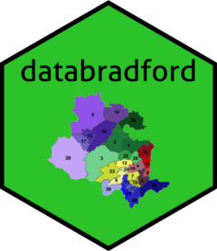

<!-- README.md is generated from README.Rmd. Please edit that file -->

```{r, include = FALSE}
knitr::opts_chunk$set(
  collapse = TRUE,
  comment = "#>",
  fig.path = "man/figures/README-",
  out.width = "100%"
)
```

# databradford 

<!-- badges: start -->
</tr>
</thead>
<tbody>
<tr class="odd">
<td align="left">
<a href="https://opensource.org/licenses/MIT"></a>
</td>
<td align="left">
<a href="https://codecov.io/gh/dataning/databradford">
  
</a>
</td>
</tr>
<tr class="odd">
<td align="left">
<a href="https://saythanks.io/to/datalulu%40gmail.com"></a>
</td>
</tr>
</tbody>
</table>
<br>

<!-- badges: end -->

The goal of databradford is to provide a quick way to explore open datasets for Bradford city.

## Roadmap

```{r echo=FALSE}
library(knitr)
df <- data.frame("Datasets" = c("Secondary school admission", "Broadband speed", 
                                "Property transaction",
                                "Crime incidents*", "Local business*", "Air quality", "Ward map"),
                 "Starting" = c("2014", "2018", "1995", "2011", "2010", "2015", "2020"), 
                 "Ending" = c("2020", "2020", "2020", "2020", "2020", "2020", "2020"),
                 "Geocoded" = c("Yes", "Yes", "Yes", "Yes", "Yes", "No", "Yes"),
                 "Raw_data_contained" = c("100%", "100%", "100%", "6.9%", "20%", "100%", "100%"), 
                 "Released" = c("No", "Yes", "No", "Yes", "No", "No", "Yes")
)
kable(df)
```

`*` Due to the size of the raw data, the package can only contain a subset of the data in this category. If you wish to use the full scale of the raw data, please contact the package developer for further data request.
  

## Use the package

You can install the development version of databradford in R from [GitHub](https://github.com/) with:

``` r
# install.packages("devtools")
devtools::install_github("dataning/databradford")
```

## Use open dataset in Bradford

```{r message=FALSE, eval=FALSE}
library(databradford)

# Broadband speed
data("broadband")

# Crime incident
data("crime")


```

## Use spatial elements for Bradford

```{r eval=FALSE}
# MSOA multipolygon
msoa_map <- msoa()

# LSOA multipolygon
lsoa_map <- lsoa()

# OA multipolygon
oa_map <- oa()

# postcode pointpolygon
postcode_map <- pc()
```

## Citation

```{}
To cite ‘databradford’ in publications use:

  Ning Lu (2021). databradford: An Open Data Package of Bradford City. R package version
  0.0.1. https://r.databradford.com

A BibTeX entry for LaTeX users is

  @Manual{,
    title = {databradford: An Open Data Package of Bradford City},
    author = {Ning Lu},
    year = {2021},
    note = {R package version 0.0.1},
    url = {https://r.databradford.com},
  }
```
