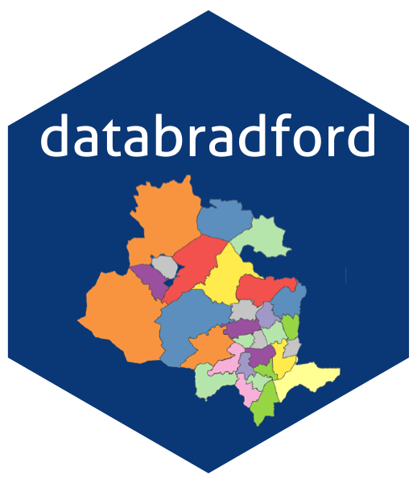

<!-- README.md is generated from README.Rmd. Please edit that file -->

```{r, include = FALSE}
knitr::opts_chunk$set(
  collapse = TRUE,
  comment = "#>",
  fig.path = "man/figures/README-",
  out.width = "100%"
)
```

# databradford 

<!-- badges: start -->
</tr>
</thead>
<tbody>
<tr class="odd">
<td align="left">
<a href="https://www.gnu.org/licenses/gpl-3.0.en.html"></a>
</td>
<td align="left">
<a href="https://codecov.io/gh/dataning/databradford">
  
</a>
</td>
</tr>
<tr class="odd">
<td align="left">
<a href="https://saythanks.io/to/datalulu%40gmail.com"></a>
</td>
</tr>
</tbody>
</table>
<br>

<!-- badges: end -->

The goal of databradford is to provide a quick way to use open datasets for 
Bradford.

## Roadmap

```{r echo=FALSE}
library(knitr)
df <- data.frame("Datasets" = c("Secondary school admission", "Broadband speed", 
                                "Property transaction",
                                "Street crime", "Local business", "Air quality"),
                 "Starting" = c("2014", "2018", "2010", "2018", "2010", "2015"), 
                 "Ending" = c("2020", "2020", "2020", "2020", "2020", "2020"),
                 "Geocoded" = c("Yes", "Yes", "Yes", "Yes", "Yes", "No"),
                 "Raw_data_contained" = c("100%", "100%", "20%", "12.5%", "20%", "100%"), 
                 "Raw_data_size" = c("small", "small", "large", "large", "large", "small")
)
kable(df)
```

## How to use the package?

You can install the development version of databradford in R from [GitHub](https://github.com/) with:

``` r
# install.packages("devtools")
devtools::install_github("dataning/databradford")
```

## Broadband speed

```{r Bradford broadband data}
library(databradford)
data("broadband")
```

## Crime incidents

```{r Crime data}
library(databradford)
data("crime")
```

